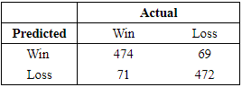

# Introduction

# Literature Review

# Data

These data come from Pro Football Reference and nflpenalties.com(include citations).
The dataset obtained from Pro Football Reference contains information about a team's performance in a given game.
The dataset from nflpenalties.com contains information about the penalties received in a given game.
After merging the two together, I then generated some variables I believed may be relevant to my analysis.
The data include information on the 2022-2023 NFL seasons.
I chose those seasons in order to hopefully mitigate variations caused by institutional changes due to the COVID-19 pandemic.

It should be noted that each game technically has two observations.
I did this because my model predicts a teams' odds of winning a given game.
(a binary variable) and so there had to be wins and losses in the data.
So, a hypothetical game between the Dallas Cowboys and the New York Jets would have two entries: one from the Cowboys' "perspective" which lists how many penalties they received, how many points they scored, etc. and one from the Jets' "perspective" containing the same information.
Here is a sample of the data:

```{r setup, include=FALSE}
knitr::opts_chunk$set(echo = TRUE)
library(tidyverse)
library(ggplot2)
library(vtable)
library(caret)
library(psych)
knitr::opts_chunk$set(fig.width=5, fig.height=3) 
```

```{r, include = F}
df <- read_csv('nfl.csv') 

```

```{r, echo = F, eval = T}
head(df)

```


```{r, echo = F}
dfNum <- df[,7:18]
#             
# names <- c("Mean", "Standard Deviation", "Minimum", "25%", 
#            "Median", "75%", "Maximum")
# 
# vars <- c("Points", "Offensive Yards", "Penalty Yards", "Penalties",
#           "Turnovers", "Turnover Diff.", "Penalty Diff.",
#           "Point Diff.", "Offensive Yards Diff.",
#           "Penalty Yard Diff.")
# 
# stats <- c('mean(x)', 'sd(x)', "min(x)", 'pctile(x)[25]',
#            "median(x)", "pctile(x)[75]", "max(x)")
# 
# widths <- c(25, 5, 25, 10, 7.5, 10, 7.5, 10)
# 
# sumStats <- sumtable(dfNum, summ.names = names, labels = vars, add.median = T,
#                      col.width = widths, summ = stats)
```

```{r, echo = F, eval = T}
# totalHome <- sum(df$home)
# homeWins <- sum(df$home*df$won)
# homeLosses <- totalHome - homeWins
# awayWins <- homeLosses
# awayLosses <- homeWins

```

# graphs/eda

```{r, include = F}
refStats <- read_csv('refStats.csv')
```

```{r, Total Penalties by Crew, echo = F, eval = T}
ggplot(refStats, aes(x = crew, y = penalties)) +
  geom_bar(stat = "identity", fill = "blue4", color = "black") +
  theme_minimal() +
  theme(axis.text.x = element_text(angle = 45, hjust = 1)) +
  labs(x = "Referee Crew", y = "Total Penalties")
```

It should be noted that both Alan Eck and Jerome Boger only officiated games for one of the two seasons in my data.
To account for the disparity in games between different crews, I also have plotted average penalties per game by crew.

```{r, Penalties/Game by Crew, echo = F, eval = T}
ggplot(refStats, aes(x = crew, y = penalties/games)) +
  geom_bar(stat = "identity", fill = "blue4", color = "black") +
  theme_minimal() +
  theme(axis.text.x = element_text(angle = 45, hjust = 1)) +
  labs(x = "Referee Crew", y = "Penalties per Game")
```

Each bar represents the difference between penalties called on the away team and penalties called on the home team over the two seasons by crew.
It should be noted that many of the referees officiated roughly 30 games over the course of the two seasons.

```{r, home penalties-away, echo = F, eval = T}
x <- refStats$aPen - refStats$hPen

ggplot(refStats, aes(x = crew, y = x)) +
  geom_bar(stat = "identity", fill = "blue4", color = "black") +
  theme_minimal() +
  theme(axis.text.x = element_text(angle = 45, hjust = 1)) +
  labs(x = "Referee Crew", y = "Difference in Away - Home")
```

This next graph represents total penalties over the two seasons for all 32 teams.
It is arranged in ascending order.
The following graph charts how many wins each team had.
It is arranged in the same order.
As you can see, there is a lot of fluctuation, giving some insight into the effect of penalties on winning.

```{r, penalties by team, echo = F}
teamPen <- df |> 
  group_by(team) |> 
  summarise(penalties = sum(pCount), 
            wins = sum(won)) |> 
  arrange(desc(penalties))

ggplot(teamPen, aes(x = reorder(team, penalties), y = penalties)) +
  geom_bar(stat = "identity", fill = "blue4", color = "black") +
  theme_minimal() +
  theme(axis.text.x = element_text(angle = 45, hjust = 1)) +
  labs(x = "Team", y = "Penalties from 22-23 Seasons") 
```

```{r, number of wins per team, echo = F, eval = T}
ggplot(teamPen, aes(x = reorder(team, penalties), y = wins)) +
  geom_bar(stat = "identity", fill = "blue4", color = "black") +
  theme_minimal() +
  theme(axis.text.x = element_text(angle = 45, hjust = 1)) +
  labs(x = "Team", y = "Wins in 22-23 Seasons") 
```

```{r, wins correlated with penalties, echo = F, eval = T}
ggplot(teamPen, aes(x = penalties, y = wins)) +
  geom_point() +
  ggtitle("Correlation Between Number of Wins and Penalties") +
  theme_minimal() +
  labs(x = "Total Penalties", y = "Wins (out of a possible 34)") 
```

```{r, echo = F}
pairs.panels(dfNum[1:6], cor = TRUE)
```

```{r, echo = F}
pairs.panels(dfNum[6:12], cor = TRUE)
```

# Create Testing and Training Data

```{r, echo = F}
df$won <- as.factor(df$won)
df$home <- as.factor(df$home)
set.seed(1)
testIndex <- createDataPartition(df$won, times = 1, p = 0.8,
                                 list = F)
train <- df[testIndex, ]
test <- df[-testIndex, ]
```

# Model

```{r, echo = F, eval = T}
mod1 <- glm(won ~ oYards + points + to + tDiff + penDiff + ydsDiff +
            pYdDiff + home, data = df, family = "binomial")
summary(mod1)
```

#Model diagnostics and analysis

```{r, echo = F, eval = T}
y = predict(mod1, df, type = "response")

y_hat <- ifelse(y > .50, 1, 0) |>
  factor(levels = levels(df$won))

lgCm <- confusionMatrix(data = y_hat, reference = df$won, positive = "1")
lgCm
```

```{r, echo = F}
max_residual <- max(mod1$residuals)
case_number <- which(mod1$residuals %in% max_residual)

cbind(max_residual, case_number)
```




